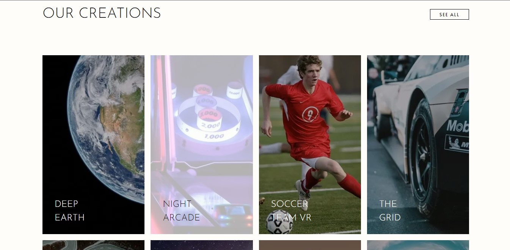

# Frontend Mentor - Loopstudios landing page solution

This is a solution to the [Loopstudios landing page challenge on Frontend Mentor](https://www.frontendmentor.io/challenges/loopstudios-landing-page-N88J5Onjw). Frontend Mentor challenges help you improve your coding skills by building realistic projects.

## Overview

### The challenge

Users should be able to:

- View the optimal layout for the site depending on their device's screen size
- See hover states for all interactive elements on the page

### Screenshot

#### Desktop mock

  
  
  
  

#### Mobile mock

  
  
  
  

### Links

- Solution URL: [FrontEnd Mentor soluton](https://www.frontendmentor.io/solutions/loop-studio-with-nextjs-and-tailwind-css-framermotion-zJWJ5Dflae)
- Live Site URL: [Loop studios](https://loop-studio-qxln85pad-acerng548.vercel.app)

## My process

### Built with

-
- CSS custom properties
- Flexbox
- CSS Grid
- Desktop-first workflow
- [Next.js](https://nextjs.org/) - React framework
- [TailwindCss](https://tailwindcss.com) - For styles
- [Framer motion](https://www.framer.com/motion/) - For animation

## Author

- Frontend Mentor - [@AcerNg548](https://www.frontendmentor.io/profile/AcerNg548)
- Twitter - [@AcerNg548](https://www.twitter.com/AcerNg548)
